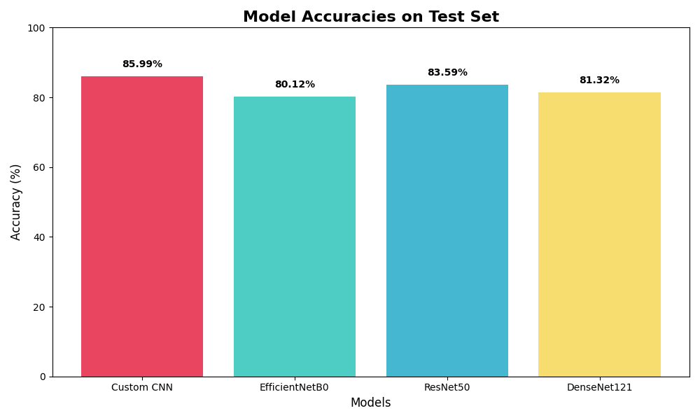

# Oral Diseases & Multi-Model Classification 🎓


A comprehensive Medical Computer Vision system built using Deep Learning to classify various oral and dental diseases from intraoral images. This graduation project explores building a custom Convolutional Neural Network (CNN) from scratch and compares its performance against industry-standard Transfer Learning models.

## 📸 Dataset & Clinical Classes

The system is trained and evaluated on 6 distinct clinical dental conditions:

- **Calculus:** Dental tartar build-up on the gingival margins.
- **Dental Caries:** Active tooth decay and structural cavities.
- **Gingivitis:** Inflammatory gum disease characterized by redness and swelling.
- **Mouth Ulcer:** Canker sores and mucosal lesions.
- **Tooth Discoloration:** Extrinsic or intrinsic tooth staining.
- **Hypodontia:** Congenitally missing teeth.

## 📊 Experimental Results & Model Evaluation

We trained and cross-evaluated 4 deep architectures. The results below summarize their classification accuracies on a completely isolated, unseen testing partition:

| Rank | Model Architecture | Test Accuracy | Size (MB) | Status |
| :--- | :--- | :---: | :---: | :--- |
| 🏆 **1st** | **Our Custom CNN (From Scratch)** | **85.99%** | ~45 MB | Best Performing Model |
| 🥈 **2nd** | **ResNet50 (Transfer Learning)** | 83.59% | ~100 MB | High Precision |
| 🥉 **3rd** | **DenseNet121 (Transfer Learning)** | 81.32% | ~35 MB | High Stability |
| 🎖️ **4th** | **EfficientNetB0 (Transfer Learning)** | 80.12% | ~20 MB | Lightweight Baseline |



## 🧠 Scientific Measures Against Data Leakage

To ensure clinical validity and generalization, this project adheres to a **Strict Evaluation Protocol**:

- **Isolated Test Set:** The test set consists of 100% original, untouched images. It was separated before any operations were performed.
- **No Pre-Augmentation Leakage:** No pre-augmented images exist in the evaluation split.
- **On-the-Fly Augmentation:** Image augmentations (such as translations, rotations, and flips) are applied dynamically in-memory during the training steps using `tf.image`, ensuring that validation/test sets remain completely pristine.
- **Architecture Preprocessing:** Each model uses its dedicated preprocessing pipeline (e.g., 1/255.0 rescaling for Custom CNN/ResNet, and native preprocessing for DenseNet/EfficientNet) to prevent color-space shift failures during inference.

## 📂 Project Organization

```text
├── Models/
│   ├── final_cnn.keras               # Serialized Custom CNN weights
│   ├── final_ResNet50.keras          # Serialized ResNet50 weights
│   ├── final_DenseNet121.keras       # Serialized DenseNet121 weights
│   ├── final_EfficientNetB0.keras    # Serialized EfficientNetB0 weights
│   └── training_metrics.json         # Evaluation metrics & history log
├── notebooks/
│   ├── Training_Kaggle.ipynb         # Main GPU training notebook (Kaggle)
│   └── Deployment_Local.ipynb        # Local deployment notebook with Gradio
├── images/
│   └── results_chart.png             # Comparative evaluation plots
├── requirements.txt                  # Python dependencies
└── README.md                         # Project documentation
```

## 🚀 Interactive Deployment Interface (Gradio)

The project features a polished, user-friendly Gradio Web Interface configured as a highly responsive application.

### Key Deployment Features:

- **🏆 Auto-Selection Mode (Default):** The interface automatically routes incoming images to the overall champion model (Custom CNN at 85.99%) for the most accurate diagnosis.
- **🤖 Multi-Model Switcher:** An interactive dropdown allows medical practitioners to manually select any of the other three architectures (ResNet, DenseNet, EfficientNet) to inspect and compare live predictions side-by-side.
- **⚡ Built-in Preprocessing:** The backend dynamically adjusts the mathematical preprocessing required for the selected model on-the-fly, ensuring consistent results.

## 💻 Local Installation & Setup

To launch the web application on your local machine:

1. Clone the Repository and navigate to the root directory.
2. Install Dependencies:
   ```bash
   pip install -r requirements.txt
   ```
3. Place the Models: Ensure your trained `.keras` files and `.json` are placed inside the `Models/` folder.
4. Run the Web Application: Open and run `notebooks/Deployment_Local.ipynb`.
5. Open the secure local link generated in the console to start diagnosing dental images!

## ⚙️ Cloud Training Environment (Kaggle)

To retrain the networks from scratch using Kaggle's dual GPU capabilities:

1. Create a new notebook on Kaggle and upload the `notebooks/Training_Kaggle.ipynb` notebook.
2. Add the official [Oral Diseases Dataset](https://www.kaggle.com/datasets/salmansajid05/oral-diseases) to your workspace.
3. In the right-side panel, set the Accelerator to **GPU T4 x2**.
4. Run all cells. The script automatically utilizes mixed-precision and distributed training.
